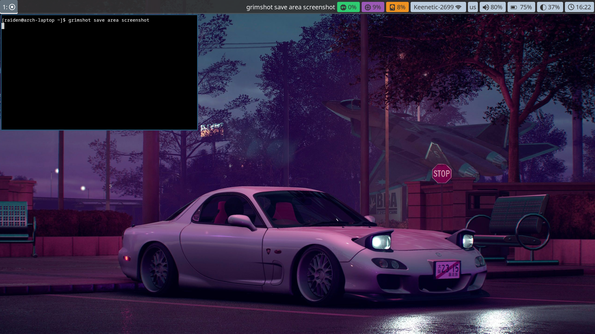
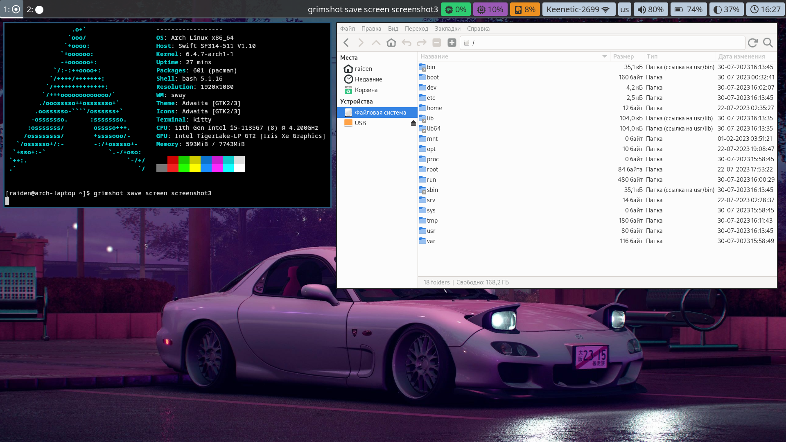

# Arch Linux + Sway WM 

- **Distro** • [Arch Linux](https://archlinux.org/)
- **Window Manager** • [Sway](https://swaywm.org/)
- **Terminal** • [Kitty](https://sw.kovidgoyal.net/kitty/)
- **Panel** • [Waybar](https://github.com/Alexays/Waybar/)
- **Launcher** • [Wofi](https://hg.sr.ht/~scoopta/wofi)
- **File Manager** • [Thunar](https://docs.xfce.org/xfce/thunar/start)
- **Browser** • [Mozilla Firefox](https://www.mozilla.org/)




## Arch Linux Installation Guide

Для начала вам необходимо раздобыть Live-образ системы. Перейдите на [страницу
загрузки дистрибутива](https://archlinux.org/download/) и создайте загрузочный
носитель. Следующим этапом подключите его к вашему компьютеру и загрузитесь с
него. В этом гайде я буду приводить целые строки из терминала, включая префикс
с именем пользователя и системы.

### Разметка диска

Первым делом необходимо соответствующим образом разметить диск; в Live-образе
системы уже имеются некоторые утилиты для разметки диска. Я обычно использую
*cfdisk*, а также довольно специфично формирую разделы - мне удобнее иметь один
раздел на всю систему (корневая ФС + пространство пользователя).

```
root@archiso ~ # lsblk                         # выводим список дисков и определяем диск на котором будет система
root@archiso ~ # cfdisk /dev/sda               # cfdisk псевдографическая утилита для создания разделов на диске
                                               # я формирую разделы следующим образом
                                               # dev/sda1 500M EFI System - Раздел для загрузчика системы
                                               # dev/sda2 8G Linux swap - Раздел подкачки
                                               # dev/sda3 'Все остальное место' - Linux filesystem
                                               # после чего форматируем и создаем соответствующие файловые системы
root@archiso ~ # mkfs.fat -F32 /dev/sda1
root@archiso ~ # mkswap -L swap /dev/sda2      
root@archiso ~ # mkfs.btrfs /dev/sda3          # я использую файловую системы btrfs
root@archiso ~ # swapon /dev/sda2              # включаем swap-раздел
```

### Установка системы

Следующим этапом необходимо подмонитровать наш раздел после чего мы установим
систему и подготовим ее к запуску.

Для того чтобы установить систему, необходимо стабильное (или не очень)
соединение с интернетом. В случае если вы подключены через Ethernet интерфейс
у вас все должно работать без всякой настройки. В случае если вы используете
*wifi* необходимо подключиться к точке доступа с помощью соответствующей утилиты
[*iwctl*](https://wiki.archlinux.org/title/Iwd), подробнее можно прочитать на
странице вики.

На этом этапе нам придется редактировать текстовые записи в файлах, в качестве
примера текстовые записи будут идти после консольной команды.

```
root@archiso ~ # ping 8.8.8.8 -c 4             # убеждаемся в наличии соединения
root@archiso ~ # mount /dev/sda3 /mnt          # монтируем раздел системы в /mnt
                                               # скачиваем и устанавливаем систему
root@archiso ~ # pacstrap /mnt base base-devel linux linux-firmware nano
                                               # генерируем таблицу разделов файловой системы
root@archiso ~ # genfstab -U /mnt >> /mnt/etc/fstab
root@archiso ~ # arch-chroot /mnt              # входим в систему, после выполнения этой команды префикс изменится!

[root@archiso /]# passwd                       # устанавливаем пароль суперпользователя
[root@archiso /]# nano /etc/hostname           # создаем новый файл в котором указываем имя ПК
                                     arch-pc

[root@archiso /]# nano /etc/hosts              # указываем локльный адрес машины и имя машины в локальном домене
                                     127.0.0.1 localhost
                                     ::1 localhost
                                     127.0.1.1 arch-pc.localdomain arch-pc

                                               # настраиваем временную зону
[root@archiso /]# ln -sf /usr/share/zoneinfo/Asia/Krasnoyarsk /etc/localtime
[root@archiso /]# hwclock --systohc            # синхронизируем часы машины

[root@archiso /]# nano /etc/locale.gen         # открываем файл локалей и раскомменчиваем локали системы
                                     раскомменчиваем строчки (# - символ комментария)
                                     #en_US.UTF-8 UTF-8
                                     #ru_RU.UTF-8 UTF-8

[root@archiso /]# locale-gen                   # генерируем локали
[root@archiso /]# nano /etc/locale.conf        # открываем файл языка системы по умолчанию и пишем туда наш язык
                                     LANG="ru_RU.UTF-8"

[root@archiso /]# nano /etc/vconsole.conf      # в файл настроек виртуальной консоли вписываем шрифт и язык для консоли
                                     KEYMAP=ru
                                     FONT=cyr-sun16

[root@archiso /]# useradd -m raiden            # создаем пользователя и задаем ему пароль
[root@archiso /]# passwd raiden -d             # ключ -d удаляет пароль пользователя
                                               # (лично я не использую пароль на домашней машине)
[root@archiso /]# usermod -aG wheel raiden     # добавляем пользователя в группу исполнителей sudo
[root@archiso /]# nano /etc/sudoers            # переходим в файл настроек sudo и убираем комментарий
                                     раскомменчиваем строчку (# - символ комментария)
                                     #%wheel ALL=(ALL:ALL) ALL

                                               # устанавливаем в систему сетевой менеджер и доп. пакеты для wifi
[root@archiso /]# pacman -S connman iwd wpa_supplicant

[root@archiso /]# mkinitcpio -p linux          # конфигурируем ядро системы учитывая все наши настройки
```

На этом установка системы почти закончена (вернее закончена), но чтобы загрузить
систему, необходимо установить загрузчик который нашу систему загрузит.

### Установка загрузчика

Существует несколько загрузчиков систем. Я пользовался такмим загрузчиками как
*grub*, *grub2*; cейчас я использую *refind*, потому что он кастомизируемый - 
в сети существует [множество гайдов](https://github.com/topics/refind-theme)
как накатить на него темы, а также он запоминает последнюю активную сессию и не
приходится выбирать систему перед каждым запуском.

После того как мы выполнили последний шаг из предыдущего раздела, нам необходимо
подмонтировать загрузочный раздел, и установить на него refind.

```
                                               # устанавливаем пакеты для загрузичка
[root@archiso /]# pacman -S refind gdisk efibootmgr
[root@archiso /]# exit                         # выходим из системы
root@archiso ~ # mkdir /mnt/boot/efi -p        # создаем каталог для загрузичка
                                               # монтируем туда загрузочный раздел
root@archiso ~ # mount /dev/sda1 /mnt/boot/efi
root@archiso ~ # arch-chroot /mnt              # входим обратно в систему
[root@archiso /]# refind-install               # устанавливаем загрузчик

                                               # переходим в файл конфигурации refind (он очень большой)
[root@archiso /]# nano /boot/efi/EFI/refind/refind.conf
                                               # находим там абзац (воспользуйтесь поиском в nano)
menuentry "Arch Linux" {
    icon     /EFI/refind/icons/os_arch.png
    volume   "Arch Linux"
    loader   /boot/vmlinuz-linux
    initrd   /boot/initramfs-linux.img
    options  "root=PARTUUID=XXXXXXXX-XXXX-XXXX-XXXX-XXXXXXXXXXXX rw add_efi_memmap"
    submenuentry "Boot using fallback initramfs" {
        initrd /boot/initramfs-linux-fallback.img
    }
    submenuentry "Boot to terminal" {
        add_options "systemd.unit=multi-user.target"
    }
    disabled
}
                                               # и меняем строчку options на следующий вариант
menuentry "Arch Linux" {
    icon     /EFI/refind/icons/os_arch.png
    volume   "Arch Linux"
    loader   /boot/vmlinuz-linux
    initrd   /boot/initramfs-linux.img
    options  "root=PARTUUID=/dev/sda3 rw add_efi_memmap"
    submenuentry "Boot using fallback initramfs" {
        initrd /boot/initramfs-linux-fallback.img
    }
    submenuentry "Boot to terminal" {
        add_options "systemd.unit=multi-user.target"
    }
    disabled
}

                                               # переходим в ещё один файл конфигурации refind
[root@archiso /]# nano /boot/refind-linux.conf # и удаляем все строчки кроме одной единственной
             
             "Boot with minimal options"    "ro root=UUID=XXXXXXXX-XXXX-XXXX-XXXX-XXXXXXXXXXXX"

[root@archiso /]# exit                         # выходим из системы, вы молодец!
```

Поздравляю, вы закончили базовую установку системы Arch Linux. В лучшем случае
при перезагрузке системы в BIOS или UEFI вы получите раздел загрузки с системой.
Самый сложный этап на мой взгляд это этап с Установкой загрузчика, именно на нем
у вас могут возникунть проблемы, поэтому вы можете обратиться к множеству
гайдов в сети :)

## Installing Sway and Configure Userspace

После того как вы войдете в начисто установленнуюб систему, вы войдете в tty
введите имя своего пользователя и приступайте к настройке и установке своего
пользовтельского простанства.

### Установка помощника для работы с пользовательским репозиторием AUR
```
pacman -S git
git clone https://aur.archlinux.org/yay.git
cd yay
makepkg -si
```

### Установка оконного менеджера Sway и набора протоколов Wayland

```
pacman -S wayland wayland-protocols xorg-xwayland sway swaybg waybar wofi
```

### Установка пакетов для звуковых устройств и наборов аудио и видео кодеков

```
pacman -S alsa-lib alsa-utils sof-firmware libinput libcanberra pulseaudio \
pulseaudio-bluetooth
pacman -S bluez bluez-utils blueman
pacman -S flac wavpack a52dec libmad libmpcdec opus libvorbis opencore-amr \
speex lame faac faad2 libfdk-aac libdca
pacman -S jasper libwebp libavif libheif libjxl
pacman -S aom rav1e dav1d svt-av1 libde265 libdv libmpeg2 schroedinger \
libtheora libvpx x264 x265 xvidcore
```

### Установка графических приложений для аудио, сети, терминала шрифтов и т.п.

```
pacman -S firefox baobab leafpad imv kitty python-pillow thunar gvfs \
thunar-volume pavucontrol
yay -S connman-gtk ttf-iosevka ttf-victor-mono
pacman -S adobe-source-han-sans-kr-fonts adobe-source-han-sans-jp-fonts \
adobe-source-han-sans-cn-fonts adobe-source-code-pro-fonts otf-font-awesome \
ttf-iosevka-nerd
```

### Установка терминальных программ и утилит

```
pacman -S bash-completion nvim ranger htop neofetch man man-pages-ru
```

## Конец?

А на сегодня все. Этот репозиторий содержит файлы конфигурации для моей системы
да и создавал я его для себя, для того чтобы облегчить установку всего
необходимого с нуля, по возможности он будет дополняться новыми утилитами и
программами для более легкого и гибкого использования ПК (по моему мнению
конечно).